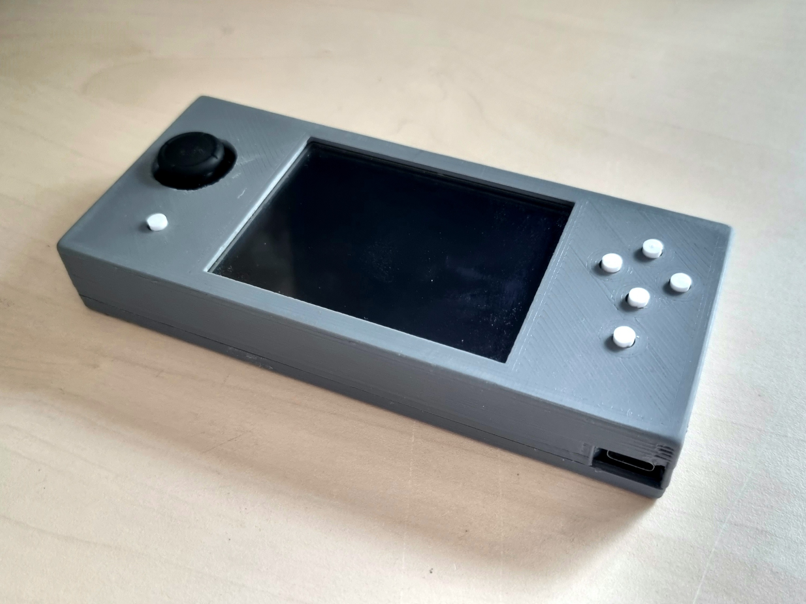
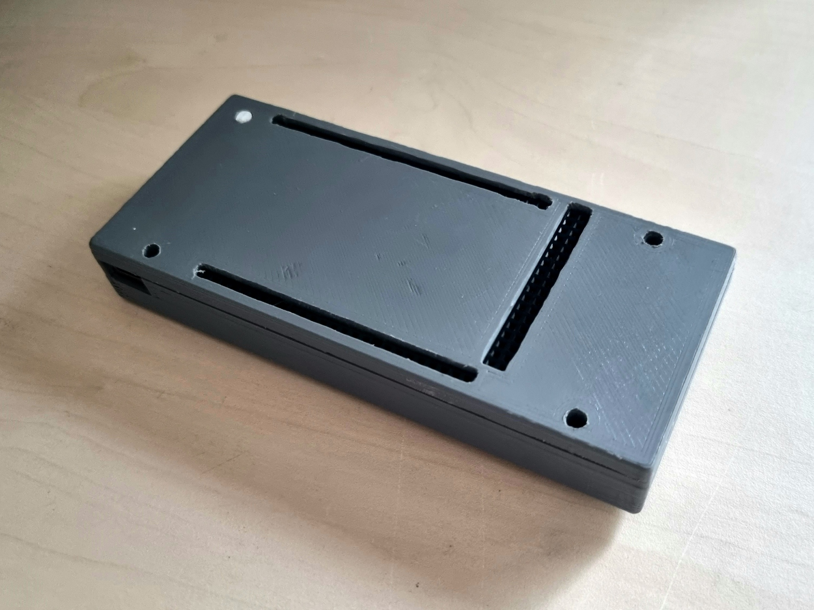

# VIN-Projekt - Miško3 igre
## Igre

## Ohišje
blender source je v razmerju 1cm ... 1m

### Verzija v1
**TESTIRANO** potrebno veliko brušenja

  
   

Napake:
- premajhno ohišje za 1mm
- premajna luknja za joystick in zamik
- majhni gumbi
- preveliki nosilci za gumbe in zamik
- zamik pinov
- leva zgornja luknja za vijak je v nerodnem položaju
### Verzija v2
**NETESTIRANO** Izboljšava v1
- povečani spredni gumbi
- povečana odprtina za joystick
- povečano ohišje za večjo toleranco 
- povečane luknje za pine
- odstranjena leva zgornja luknja za vijak
